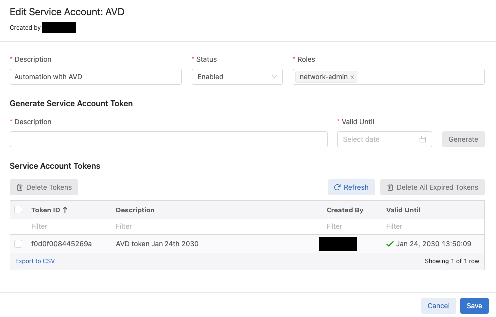

### The purpose of this tutorial is to review the steps required in order to integrate AVD with Arista CVaaS.


### Within CVaaS navigate to:
### Settings and Tools --> Access Control --> Service Accounts --> "New Service Account"

```text
Account name: AVD
Description: "Automation with AVD"
Give a description under "Generated Service Account Token"
Specify the "valid until" date.
Make sure you copy the generated password since you only get one chance to see it.
Click "Save" to exit the dialogue box. 
```


### Add CVAAS to your Ansible inventory file:

```text
DC1:
  children:
    CVAAS:
      hosts:
        cvaas:
```

### Create a folder under group_vars named CVAAS and add a file "cvaas_auth.yml". Your file should look similar to this:

```text
ansible_host: www.arista.io
ansible_user: cvaas
# Good until 1/24/2030
# In a production environment make sure to use Ansible Vault.

ansible_ssh_pass: <super long password>
ansible_connection: httpapi
ansible_network_os: eos
ansible_httpapi_use_ssl: True
ansible_httpapi_validate_certs: False
ansible_httpapi_port: 443
```

A key point is that in my file I am using Ansible Vault. For testing/lab purposes you can just put the password that you generated in CVaaS in the "ansible_ssh_pass" field.

### Testing your setup.
```text
root@6e3d94f50dca:/workspace# pwd
/workspaces/avd-cvaas-integration/avd
root@6e3d94f50dca:/workspace# ansible-playbook playbooks/cvaas_facts.yml
Vault password: 

PLAY [Playbook to demonstrate cv_container module.] *********************************************************************************************************************************

TASK [Gather CVaaS facts from cvaas] ************************************************************************************************************************************************
ok: [cvaas]

PLAY RECAP **************************************************************************************************************************************************************************
cvaas                      : ok=1    changed=0    unreachable=0    failed=0    skipped=0    rescued=0    ignored=0  
```

### Sample playbook cvaas_facts.yml
```text
---
- name: Playbook to demonstrate cv_container module.
  hosts: cvaas
  connection: local
  gather_facts: no
  collections:
    - arista.cvp

  tasks:
    - name: "Gather CVaaS facts from {{inventory_hostname}}"
      cv_facts:
      register: cvp_facts
```

If the playbook runs and completes successfully you are now able to successfully talk to CVaaS.
you can add -vvv to the end and see ansible display additional info about your CVaaS instance.

Now that AVD is talking to the CVaaS service you can run the "cvaas_deploy.yml" playbook to push build out your containers, move devices to the proper container and then apply the generated config to the device.

### Sample playbook cvaas_deploy.yml
```text
---
- name: Configlet upload management
  hosts: cvaas
  connection: local
  gather_facts: no
  tasks:

  - name: "Uploading configlets to CVaaS"
    import_role:
      name: arista.avd.eos_config_deploy_cvp
    vars:
      container_root: 'DC1_FABRIC'
      configlets_prefix: 'DC1'
      state: present
      cv_collection: v3
      execute_tasks: false
```


Once things are working it's a good idea to use Ansible Vault to encrypt your passwords.

```text
ansible-vault encrypt_string '<super long password>' --name 'ansible_ssh_pass'
```

### Key points:
1. When creating the vault sometimes there will be an extra "%" sign at the end. Remove this.

          $ANSIBLE_VAULT;1.1;AES256
          31383837323464376439313531333639373431316433636361633239663632663331383264646639
          3535386333356537643233376630636265653566636531390a663433323033653736653939663861
          33313466646363643135353065346439326633326138636331333331333338393332653231643930
          6661353835373731350a303666343334626532313361376361656235323638646264656639653139
          3437% <------------------Make sure to remove.

2. Sometimes when creating your vault there will be so much output that you will overrun the buffer on your CLI window. In order to get around this you can simply write the output to a file and then open up the file to grab the hash.

```text
ansible-vault encrypt_string '<super long password>' --name 'ansible_ssh_pass' >> my_file.txt
```

### Once Ansible Vault has been added to your config simply add --ask-vault-pass when running the playbook.

```text
root@6e3d94f50dca:/workspace# ansible-playbook playbooks/cvaas_facts.yml --ask-vault-pass
Vault password: 

PLAY [Playbook to demonstrate cv_container module.] **************************************************************************************************************************************************

TASK [Gather CVaaS facts from cvaas] *****************************************************************************************************************************************************************
ok: [cvaas]

PLAY RECAP *******************************************************************************************************************************************************************************************
cvaas                      : ok=1    changed=0    unreachable=0    failed=0    skipped=0    rescued=0    ignored=0   
```